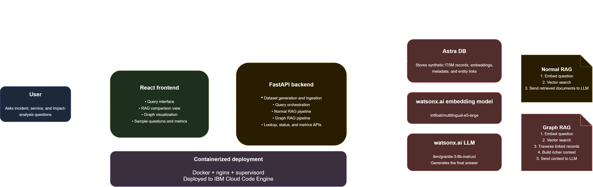

---
# YAML Metadata for IBM Developer
draft: true
ignore_prod: true

# Lifecycle dates
completed_date: '2026-03-11'
last_updated: '2026-03-11'
check_date: '2027-06-11'

# Authors - UPDATE WITH YOUR INFORMATION
authors:
  - name: Himangshu Mech
    email: himangshu.mech@in.ibm.com
    
  - name: Megha Jingar
    email: megha.jingar1@ibm.com

# Editors - No changes needed
editors:
  - name: Michelle Corbin
    email: corbinm@us.ibm.com
  - name: Bindu Umesh
    email: binumesh@in.ibm.com

# Title and Subtitle (55 characters for title)
title: 'Build a Graph RAG application with BFS traversal for enterprise ITSM'
meta_title: 'Build a Graph RAG application with BFS traversal for enterprise ITSM'
subtitle: 'Compare vector-only RAG with relationship-aware Graph RAG using Astra DB and IBM watsonx'

# SEO metadata (150-160 characters for meta_description)
excerpt: 'Learn how to build a production-grade Graph RAG application that uses Breadth-First Search traversal to follow relationship links in enterprise IT Service Management data, comparing it side-by-side with standard vector-only RAG.'
meta_description: 'Build a Graph RAG application using Astra DB, IBM watsonx, and BFS traversal. Compare Normal RAG vs Graph RAG for enterprise ITSM queries with a complete working demo.'

# Keywords (1-3 keywords)
meta_keywords: 'graph rag, retrieval augmented generation, vector database'

# Tags - Editors will finalize using taxonomy
primary_tag: artificial-intelligence
tags:
  - artificial-intelligence
  - data-science
  - databases
components:
  - astra-db
  - watsonx

# Related content - Editors will add if applicable
# related_content:
#   - type: tutorials
#     slug: agentic-rag-watsonx-orchestrate-astradb
---

Enterprise IT operations teams face a critical challenge: their data is not a flat collection of documents—it's a web of relationships. When an incident occurs, it's linked to configuration items, problem records, change requests, and knowledge base articles. Standard Retrieval-Augmented Generation (RAG) systems use vector similarity to find relevant documents, but they cannot follow these relationship chains.

**Graph RAG** solves this by treating your document store as a graph. After an initial vector search identifies seed documents, a Breadth-First Search (BFS) traversal follows relationship links embedded in document metadata, collecting connected documents up to a configurable depth. This provides richer, relationship-aware context that enables large language models (LLMs) to reason across the full entity graph.

**In this tutorial**, learn how to build a production-grade Graph RAG application that uses BFS traversal to follow relationship links in enterprise IT Service Management data. You'll generate synthetic ITSM data, ingest it into DataStax Astra DB with IBM watsonx.ai embeddings, implement both Normal RAG and Graph RAG pipelines, and create a Carbon Design System UI that compares both approaches side-by-side with D3.js graph visualization.

> **Get the code**: The complete source code for this tutorial is available on GitHub. Clone the repository and follow the setup instructions to run the application locally or with Docker. The repository includes all backend code, frontend components, Docker configuration, and sample data generators.

## Architecture

The application follows a modern three-tier architecture with a single-container deployment:



**Data Layer**: DataStax Astra DB stores 1,370 ITSM documents (incidents, problems, changes, KB articles, configuration items, business services) with 1024-dimensional vectors from IBM watsonx's `intfloat/multilingual-e5-large` embedding model. Each document contains a `metadata.links` array storing the IDs of related documents—this is the graph edge list that enables BFS traversal.

**Backend Layer**: A FastAPI application exposes REST endpoints for Normal RAG (vector search only) and Graph RAG (vector search + BFS traversal). The Normal RAG pipeline performs a single Approximate Nearest Neighbor (ANN) search in Astra DB. The Graph RAG pipeline starts with the same ANN search to find seed documents, then uses a BFS algorithm with a `collections.deque` to traverse relationship links, fetching connected documents up to depth 2 or until 10 documents are collected.

**Frontend Layer**: A React application built with Carbon Design System v11 provides a dark-themed UI (g100) with side-by-side query comparison, D3.js force-directed graph visualization of the BFS traversal path, and real-time performance metrics. The UI includes sample queries categorized by complexity (easy, medium, complex) to demonstrate when each approach wins.

**Deployment**: The entire stack runs in a single Docker container using Red Hat Universal Base Image (UBI) 9 with Python 3.12. Supervisord manages both nginx (serving React on port 9000 and proxying `/api/*` to the backend) and uvicorn (running FastAPI on internal port 8000).

**Data Flow**: When a user submits a query, the frontend sends parallel requests to both `/query/normal` and `/query/graph`. Each endpoint embeds the query using watsonx, retrieves documents from Astra DB (Normal RAG: top-5 by similarity; Graph RAG: top-3 seeds + BFS traversal), builds context, and calls IBM Granite 3 8B Instruct to generate an answer. The Graph RAG response includes a `traversal_path` array that the frontend renders as an interactive graph.

## Prerequisites

Before starting this tutorial, ensure you have:

| Requirement | Version | Purpose |
|-------------|---------|---------|
| **Python** | 3.12+ | Backend runtime |
| **Node.js** | 20+ | Frontend build |
| **Docker Desktop** | 24+ | Container deployment |
| **DataStax Astra DB account** | Free tier | Vector database with 1024d support |
| **IBM watsonx.ai account** | Free trial or paid | Embeddings and LLM inference |

**Astra DB Setup**: Create a free account at [astra.datastax.com](https://astra.datastax.com). You'll need an Application Token and API Endpoint.

**IBM watsonx.ai Setup**: Sign up at [cloud.ibm.com](https://cloud.ibm.com/catalog/services/watson-machine-learning). Create a project and note your Project ID and API Key.

**Skills**: Basic familiarity with Python, React, REST APIs, and Docker. No prior knowledge of RAG or graph algorithms required.

## Steps

### Step 1. Clone the repository and configure credentials

Clone the project repository and set up your environment:

```bash
git clone https://github.com/IBM/enterprise-itsm-graph-rag
cd enterprise-itsm-graph-rag/code
```

Copy the environment template and add your credentials:

```bash
cp .env.example .env
```

Edit `.env` with your Astra DB and watsonx credentials:

```env
# Astra DB Configuration
ASTRA_DB_APPLICATION_TOKEN=AstraCS:xxxxx
ASTRA_DB_API_ENDPOINT=https://xxxxx-xxxxx.apps.astra.datastax.com
ASTRA_DB_KEYSPACE=graphCollection
ASTRA_DB_COLLECTION=itsm_documents

# IBM watsonx Configuration
WATSONX_API_KEY=your-watsonx-api-key
WATSONX_PROJECT_ID=your-project-id
WATSONX_URL=https://us-south.ml.cloud.ibm.com

# Model Configuration
EMBEDDING_MODEL_ID=intfloat/multilingual-e5-large
LLM_MODEL_ID=ibm/granite-3-8b-instruct
```

**Security Note**: The `.env` file is gitignored. Never commit credentials to version control.

### Step 2. Understand the graph data model

The key insight that makes Graph RAG work is storing relationships inside documents. Each document in Astra DB has a `metadata.links` array containing the `_id` values of related documents:

```json
{
  "_id": "INC-uuid-12345",
  "page_content": "Incident: INC0000031\nDescription: High CPU usage on api-server-002...",
  "$vector": [0.023, -0.041, ...1024 floats...],
  "metadata": {
    "type": "incident",
    "number": "INC0000031",
    "priority": "P1",
    "state": "Resolved",
    "links": [
      "PRB-uuid-67890",
      "CHG-uuid-11111",
      "KB-uuid-22222"
    ]
  }
}
```

The ITSM entity graph follows these relationships:

```
BusinessService ──has──► ConfigurationItem
ConfigurationItem ──affected_by──► Incident
Incident ──caused──► ProblemRecord
ProblemRecord ──resolved_by──► ChangeRequest
ChangeRequest ──documented_in──► KBArticle
KBArticle ──references──► Incident / ProblemRecord
```

The BFS traversal reads the `links` array to discover which documents to fetch next, building a relationship-aware context without requiring a separate graph database.

### Step 3. Generate synthetic ITSM data

The `data_generator.py` script creates a realistic dataset with cross-entity relationships:

| Entity Type | Count | Key Relationships |
|-------------|-------|-------------------|
| Business Services | 20 | Depend on each other |
| Configuration Items | 120 | Belong to business services |
| Incidents | 800 | Linked to CIs, problems, changes, KB articles |
| Change Requests | 200 | Linked to incidents and problems |
| Problem Records | 80 | Linked to incidents and changes |
| KB Articles | 150 | Linked to incidents and problems |
| **Total** | **1,370** | |

Generate the data:

```bash
cd backend
python data_generator.py
```

This creates `../data/combined_dataset.json` with all entities and their relationship links. The generator uses Python `dataclasses` for type safety and randomly assigns related IDs to build realistic cross-entity connections.

**Note**: The data is generated in-memory and saved to JSON. The Docker deployment generates data on-demand via the UI's "Populate Data" button, eliminating the need for pre-generated files.

### Step 4. Ingest data into Astra DB with embeddings

The `ingest.py` script performs three critical operations:

**1. Create the collection** with correct vector dimensions:

```python
from astrapy import DataAPIClient
from astrapy.constants import VectorMetric
from astrapy.info import CollectionDefinition

collection = db.create_collection(
    "itsm_documents",
    definition=CollectionDefinition.builder()
        .set_vector_dimension(1024)
        .set_vector_metric(VectorMetric.COSINE)
        .build()
)
```

**2. Flatten relationship links** from typed dict to flat array:

```python
# Transform {"problems": ["id1"], "changes": ["id2"]} → ["id1", "id2"]
links = item.get("links", {})
all_links = []
if isinstance(links, dict):
    for link_list in links.values():
        if isinstance(link_list, list):
            all_links.extend(link_list)
```

This flattening is essential—the BFS traversal expects `metadata.links` as a simple list of document IDs.

**3. Generate embeddings** using IBM watsonx:

```python
from ibm_watsonx_ai.foundation_models import Embeddings
from ibm_watsonx_ai.metanames import EmbedTextParamsMetaNames as EmbedParams

embedding = Embeddings(
    model_id="intfloat/multilingual-e5-large",
    params={EmbedParams.TRUNCATE_INPUT_TOKENS: 512},
    credentials=credentials,
    project_id=WATSONX_PROJECT_ID
)
vectors = embedding.embed_documents(texts=texts)
```

The `page_content` field (human-readable text representation) is embedded into a 1024-dimensional vector.

Run the ingestion:

```bash
python ingest.py
```

Ingestion takes 3–5 minutes for 1,370 documents. Documents are processed in batches of 20 with 0.5-second delays to respect watsonx API rate limits.

### Step 5. Implement the Normal RAG pipeline

Normal RAG performs a single vector similarity search. In `rag_pipelines.py`, the `NormalRAG` class extends `BaseRAG`:

```python
class NormalRAG(BaseRAG):
    def retrieve(self, question: str, top_k: int = 5) -> List[Dict[str, Any]]:
        # Embed the query
        query_embedding = self._embed_query(question)
        
        # ANN search in Astra DB
        results = self.collection.find(
            sort={"$vector": query_embedding},
            limit=top_k,
            include_similarity=True
        )
        
        return list(results)
```

This returns the `top_k` documents whose embeddings are closest to the query embedding in cosine space. It's fast (one network call) and effective for factual lookups, but cannot follow relationships.

The `generate_answer` method formats retrieved documents as numbered sources and calls IBM Granite 3 8B Instruct:

```python
def generate_answer(self, question: str, documents: List[Dict]) -> str:
    context = self._format_context(documents)
    
    prompt = f"""You are an IT operations assistant. Answer the question using ONLY the provided context.
    
Context:
{context}

Question: {question}

Answer:"""
    
    response = self.llm.generate_text(prompt=prompt)
    return response
```

### Step 6. Implement the Graph RAG pipeline with BFS traversal

Graph RAG extends Normal RAG with a two-phase approach:

**Phase 1 — Vector search (depth 0)**: Retrieve 3 seed documents using ANN search.

**Phase 2 — BFS traversal**: Use a `collections.deque` to process each seed document:

```python
from collections import deque

class GraphRAG(BaseRAG):
    def retrieve_with_traversal(
        self, 
        question: str, 
        start_k: int = 3,
        max_depth: int = 2,
        select_k: int = 10
    ) -> Tuple[List[Dict], List[Dict]]:
        # Phase 1: Get seed documents
        query_embedding = self._embed_query(question)
        seed_results = self.collection.find(
            sort={"$vector": query_embedding},
            limit=start_k,
            include_similarity=True
        )
        
        # Phase 2: BFS traversal
        queue = deque([(doc["_id"], 0) for doc in seed_results])
        visited = set(doc["_id"] for doc in seed_results)
        all_documents = list(seed_results)
        traversal_path = []
        
        while queue and len(all_documents) < select_k:
            current_id, current_depth = queue.popleft()
            
            if current_depth >= max_depth:
                continue
            
            # Fetch current document
            current_doc = self.collection.find_one(filter={"_id": current_id})
            
            # Traverse links
            for link_id in current_doc.get("metadata", {}).get("links", []):
                if link_id not in visited and len(all_documents) < select_k:
                    linked_doc = self.collection.find_one(filter={"_id": link_id})
                    if linked_doc:
                        all_documents.append(linked_doc)
                        visited.add(link_id)
                        queue.append((link_id, current_depth + 1))
                        traversal_path.append({
                            "from": current_id,
                            "to": link_id,
                            "depth": current_depth + 1
                        })
        
        return all_documents, traversal_path
```

**Why BFS over DFS?** BFS ensures directly related documents (one hop away) are always included before more distant ones. For ITSM data, an incident's direct links (its problem record, its change request) are more relevant than the problem record's links to other incidents.

**The `select_k` limit** prevents runaway traversal. Without it, a highly connected node could trigger hundreds of database calls. The limit ensures traversal stops as soon as enough documents are collected.

### Step 7. Build the FastAPI backend

The `main.py` FastAPI application exposes query endpoints:

```python
from fastapi import FastAPI, BackgroundTasks
from pydantic import BaseModel

app = FastAPI(title="Enterprise ITSM Graph RAG API")

class QueryRequest(BaseModel):
    question: str
    top_k: int = 10

class QueryResponse(BaseModel):
    answer: str
    sources: List[Dict]
    retrieval_time: float
    generation_time: float
    total_time: float
    num_sources: int
    traversal_path: Optional[List[Dict]] = None

@app.post("/query/normal", response_model=QueryResponse)
async def query_normal(request: QueryRequest):
    start_time = time.time()
    
    # Retrieve documents
    retrieval_start = time.time()
    documents = normal_rag.retrieve(request.question, request.top_k)
    retrieval_time = time.time() - retrieval_start
    
    # Generate answer
    generation_start = time.time()
    answer = normal_rag.generate_answer(request.question, documents)
    generation_time = time.time() - generation_start
    
    return QueryResponse(
        answer=answer,
        sources=documents,
        retrieval_time=retrieval_time,
        generation_time=generation_time,
        total_time=time.time() - start_time,
        num_sources=len(documents)
    )

@app.post("/query/graph", response_model=QueryResponse)
async def query_graph(request: QueryRequest):
    start_time = time.time()
    
    # Retrieve with traversal
    retrieval_start = time.time()
    documents, traversal_path = graph_rag.retrieve_with_traversal(
        request.question, 
        start_k=3, 
        max_depth=2, 
        select_k=request.top_k
    )
    retrieval_time = time.time() - retrieval_start
    
    # Generate answer
    generation_start = time.time()
    answer = graph_rag.generate_answer(request.question, documents)
    generation_time = time.time() - generation_start
    
    return QueryResponse(
        answer=answer,
        sources=documents,
        retrieval_time=retrieval_time,
        generation_time=generation_time,
        total_time=time.time() - start_time,
        num_sources=len(documents),
        traversal_path=traversal_path
    )
```

Additional endpoints include `/metrics` (aggregated performance stats), `/data-status` (check if collection is populated), and `/populate` (trigger background data generation and ingestion).

Test the backend locally:

```bash
pip install -r requirements.txt
uvicorn main:app --host 0.0.0.0 --port 8000 --reload
```

Visit `http://localhost:8000/docs` for interactive API documentation.

### Step 8. Build the Carbon Design System frontend

The React frontend uses Carbon Design System v11 for all UI components:

```bash
cd frontend
npm install
npm start
```

**Key Components**:

**1. Three-tier sample queries** demonstrate when each approach wins:

| Tier | Label | Example Query |
|------|-------|---------------|
| 🟢 Easy | Normal RAG Wins | "How do I resolve high CPU usage on a server?" |
| 🟡 Medium | Mixed | "What incidents have occurred on api-server-002?" |
| 🔴 Complex | Graph RAG Wins | "Trace the full impact chain for the slow response time problem" |

**2. Query intent classifier** detects simple factual queries (matching patterns like `how to resolve`, `steps to`, direct ticket numbers) and shows a hint that Normal RAG may be sufficient. Relationship queries (matching `impact chain`, `root cause`, `linked to`) suppress the hint.

**3. D3.js graph visualization** renders the `traversal_path` array as a force-directed graph:

```javascript
import * as d3 from 'd3';

const GraphVisualization = ({ traversalPath, documents }) => {
  useEffect(() => {
    // Build nodes and links from traversal path
    const nodes = documents.map(doc => ({
      id: doc._id,
      type: doc.metadata.type,
      number: doc.metadata.number,
      depth: doc.depth || 0
    }));
    
    const links = traversalPath.map(path => ({
      source: path.from,
      target: path.to
    }));
    
    // Create force simulation
    const simulation = d3.forceSimulation(nodes)
      .force("link", d3.forceLink(links).id(d => d.id))
      .force("charge", d3.forceManyBody().strength(-300))
      .force("center", d3.forceCenter(width / 2, height / 2));
    
    // Render with Carbon color tokens
    const colorMap = {
      incident: '#da1e28',        // Carbon Red 60
      problem_record: '#ff832b',  // Carbon Orange 40
      change_request: '#0f62fe',  // Carbon Blue 60
      kb_article: '#24a148',      // Carbon Green 50
      configuration_item: '#8a3ffc', // Carbon Purple 60
      business_service: '#009d9a'    // Carbon Teal 50
    };
    
    // ... D3 rendering code
  }, [traversalPath, documents]);
  
  return <svg ref={svgRef} />;
};
```

Seed nodes (depth 0) are rendered larger. Hovering shows a tooltip with document content.

### Step 9. Containerize with Docker

The application uses a multi-stage Docker build:

**Stage 1** (Node 20 Alpine) builds the React frontend:

```dockerfile
FROM node:20-alpine AS frontend-builder
WORKDIR /app/frontend
COPY frontend/package*.json ./
RUN npm install --silent
COPY frontend/ .
ARG REACT_APP_API_URL=/api
ENV REACT_APP_API_URL=$REACT_APP_API_URL
RUN npm run build
```

**Stage 2** (UBI 9 Python 3.12) creates the runtime container:

```dockerfile
FROM registry.access.redhat.com/ubi9/python-312:latest
USER root

# Install nginx and supervisor
RUN dnf install -y nginx && \
    dnf clean all && \
    pip install --no-cache-dir supervisor

# Copy backend
WORKDIR /app/backend
COPY backend/requirements.txt .
RUN pip install --no-cache-dir -r requirements.txt
COPY backend/ .

# Copy frontend build
COPY --from=frontend-builder /app/frontend/build /usr/share/nginx/html

# Configure nginx (proxy /api/* to uvicorn on port 8000)
COPY nginx-combined.conf /etc/nginx/conf.d/default.conf

# Configure supervisord (manage nginx + uvicorn)
RUN mkdir -p /etc/supervisor/conf.d
COPY supervisord.conf /etc/supervisor/conf.d/supervisord.conf

EXPOSE 9000
CMD ["/opt/app-root/bin/supervisord", "-c", "/etc/supervisor/conf.d/supervisord.conf"]
```

Build and run:

```bash
docker compose up --build
```

Access the application at `http://localhost:9000`.

### Step 10. Test with sample queries

**Query 1: Simple factual lookup**

```
Query: "How do I resolve high CPU usage on a server?"
```

**Normal RAG**: Retrieves the KB article on CPU troubleshooting as the top result. Response time: ~2–3 seconds.

**Graph RAG**: Starts with the same KB article, then traverses to related incidents. Adds 3–5 extra database calls without improving the answer.

**Verdict**: Normal RAG is faster and equally accurate for single-document factual lookups.

---

**Query 2: Multi-entity analysis**

```
Query: "What incidents have occurred on api-server-002 and what is their priority?"
```

**Normal RAG**: Returns 5 incidents most semantically similar to the query. May miss some incidents if descriptions aren't close in embedding space.

**Graph RAG**: Finds 3 seed incidents, then traverses to their linked problem records and the CI document for `api-server-002`. Provides infrastructure context that Normal RAG misses.

**Verdict**: Graph RAG provides richer context. Choose based on whether relationship context matters.

---

**Query 3: Deep relationship traversal**

```
Query: "Trace the full impact chain for the slow response time problem: which incidents caused it, what is the root cause, and what changes were made to resolve it?"
```

**Normal RAG**: Returns 5 documents semantically similar to "slow response time problem"—likely all incidents. Does not retrieve the problem record, root cause analysis, or change request.

**Graph RAG**: Starts with 3 seed incidents. At depth 1, BFS follows links to `PRB0000012` (root cause: database connection pool exhaustion). At depth 2, follows links to `CHG0000034` (fix: increased pool size) and `KB0000089` (tuning guide).

The LLM now has the full chain:
- Which incidents triggered investigation
- Root cause in the problem record
- Change request that implemented the fix
- KB article documenting the procedure

**Verdict**: Graph RAG is the only approach that can correctly answer relationship traversal queries.

### Step 11. Deploy to IBM Cloud Code Engine

For production deployment on IBM Cloud:

1. Push your repository to GitHub (`.env` is gitignored—credentials are safe)

2. Create a Code Engine project:
   ```bash
   ibmcloud ce project create --name itsm-graph-rag
   ```

3. Create a build from your Git repository:
   ```bash
   ibmcloud ce build create --name itsm-build \
     --source https://github.com/your-org/enterprise-itsm-graph-rag \
     --context-dir . \
     --dockerfile Dockerfile
   ```

4. Create secrets for your credentials:
   ```bash
   ibmcloud ce secret create --name astra-creds \
     --from-literal ASTRA_DB_APPLICATION_TOKEN=AstraCS:xxxxx \
     --from-literal ASTRA_DB_API_ENDPOINT=https://xxxxx.apps.astra.datastax.com
   
   ibmcloud ce secret create --name watsonx-creds \
     --from-literal WATSONX_API_KEY=your-key \
     --from-literal WATSONX_PROJECT_ID=your-project-id
   ```

5. Deploy the application:
   ```bash
   ibmcloud ce app create --name itsm-graph-rag \
     --build-source itsm-build \
     --port 9000 \
     --env-from-secret astra-creds \
     --env-from-secret watsonx-creds \
     --min-scale 1 --max-scale 3
   ```

6. Get the application URL:
   ```bash
   ibmcloud ce app get --name itsm-graph-rag --output url
   ```

Open the URL, click **Populate Data**, wait for ingestion, and start querying.

## Summary

You've successfully built a production-grade Graph RAG application that demonstrates the power of relationship-aware retrieval for enterprise IT operations. By completing this tutorial, you've learned how to:

- Store graph edges directly in Astra DB documents using `metadata.links` arrays—eliminating the need for a separate graph database
- Implement BFS traversal to follow relationship chains and collect connected documents up to a configurable depth
- Compare Normal RAG (vector-only) with Graph RAG (vector + traversal) side-by-side to understand their strengths and trade-offs
- Deploy a complete application stack using Docker with FastAPI backend and Carbon Design System frontend
- Visualize graph traversal paths using D3.js for explainability and debugging

**Key benefits of Graph RAG**:

- **Relationship awareness**: Answers complex multi-hop queries that require context from multiple connected entities
- **Explainability**: The `traversal_path` enables visualization and auditing of how answers were constructed
- **No separate graph database**: Store edges in document metadata and use your existing vector database
- **Tunable performance**: Control depth and document limits to balance context richness with response time

**When to use each approach**:

| Use Case | Recommended Approach | Reason |
|----------|---------------------|---------|
| Direct factual lookups | Normal RAG | Faster (0.5–1s), single document sufficient |
| Root cause analysis | Graph RAG | Requires traversing incident → problem → change chain |
| Impact chain tracing | Graph RAG | Needs full relationship context across entities |
| Latency-critical apps | Normal RAG | Minimal database calls, predictable performance |
| Multi-entity queries | Graph RAG | Collects related context from connected documents |

### Next steps

**Enhance your Graph RAG application**:

1. **Add hybrid search**: Combine BFS traversal with metadata filtering to only traverse documents matching specific criteria (e.g., P1 incidents, specific time ranges)
2. **Implement weighted edges**: Assign relationship strength scores based on entity types and use weighted BFS to prioritize more relevant connections
3. **Enable streaming responses**: Use FastAPI `StreamingResponse` with Server-Sent Events to stream LLM tokens in real-time for better user experience
4. **Experiment with larger models**: Swap `ibm/granite-3-8b-instruct` for `ibm/granite-13b-instruct-v2` or `meta-llama/llama-3-70b-instruct` for improved answer quality
5. **Deploy to production**: Use the UBI Python 3.12 base image to deploy on Red Hat OpenShift or IBM Cloud Code Engine for enterprise-grade hosting

**Continue learning**:

- Explore [watsonx.ai foundation models](https://www.ibm.com/products/watsonx-ai/foundation-models) to understand available LLMs and embeddings
- Learn about [agentic RAG with watsonx Orchestrate](https://developer.ibm.com/tutorials/agentic-rag-watsonx-orchestrate-astradb/) for building AI agents
- Master [Carbon Design System React components](https://react.carbondesignsystem.com/) for building enterprise UIs
- Review [Astra DB vector search documentation](https://docs.datastax.com/en/astra/astra-db-vector/) for advanced vector database features

**Try it yourself**:

Ready to build your own Graph RAG application? Start your [free Astra DB trial](https://astra.datastax.com) and [watsonx.ai trial](https://cloud.ibm.com/catalog/services/watson-machine-learning) today.

### Acknowledgements

We would like to extend our sincere thanks to the IBM Developer team for their assistance in publishing this article, and to Bindu Umesh for her support in reviewing the initial version.
